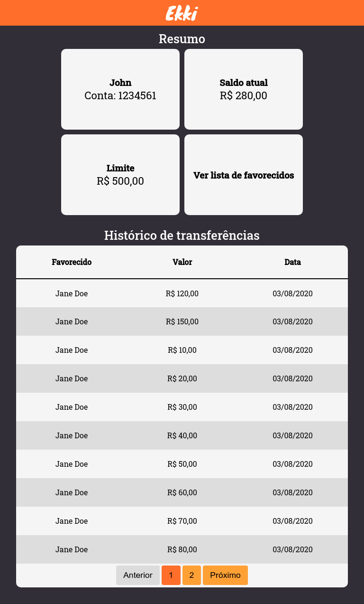
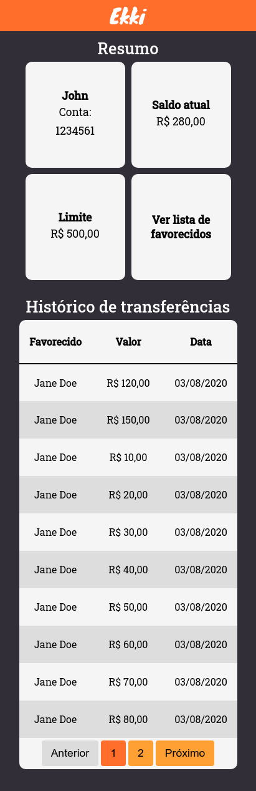

<h1 align="center">
    
</h1>

<h4 align="center">
  💲 Transferência de dinheiro para outras pessoas de forma fácil, objetiva e sem taxas.
</h4>

---

  
  
  

---

## 🚀 Tecnologias

Esse projeto foi desenvolvido com as seguintes tecnologias:

### Backend
- [Node.js](https://nodejs.org/en/)
- [ExpressJS](https://expressjs.com/)
- [Docker](https://www.docker.com/)
- [PostgreSQL](https://www.postgresql.org/)
- [TypeORM](https://typeorm.io/)
- [TSyringe (Injeção de dependência)](https://github.com/microsoft/tsyringe)
- [Celebrate (Validation)](https://github.com/arb/celebrate)
- [Jest](https://jestjs.io/)
---
### Frontend
- [Axios](https://github.com/axios/axios)
- [React](https://reactjs.org)
- [React Router](https://reactrouter.com/)
- [Styled-Components](https://www.styled-components.com/)
- [Styled-Media-Query](https://github.com/morajabi/styled-media-query)
- [SweetAlert](https://prettier.io/)
- [Unform](https://unform.dev/)
- [Yup](https://github.com/jquense/yup)

---
### Ambos
- [Date-fns](https://date-fns.org/)
- [Eslint](https://eslint.org/)
- [Prettier](https://prettier.io/)
- [Typescript](https://www.typescriptlang.org/)

---

## 💻 Projeto

O Ekki surgiu depois que a área de produto chegou à conclusão, após fazer diversas pesquisas com usuários, que é necessário criar uma aplicação web para reter seus clientes, onde seja possível transferir dinheiro para outras pessoas de forma fácil, objetiva e sem taxas.

---

## ✋🏻 Pré-requisitos

1. Ter o NodeJS (>=12) instalado;
2. Tenha o Docker instalado;
3. Execute o comando para criação do banco de dados `docker run --name ekki_pg -e POSTGRES_DB=ekki -e POSTGRES_USER=ekki -e POSTGRES_PASSWORD=ekki -p 5432:5432 -d postgres`;
4. Execute as migrations para criação das tabelas `yarn migration:run`;
5. Executa os seeds para popular o banco de dados `yarn seed:run`;

---

## 🔥 Instalação e execução

1. Faça um clone desse repositório;
2. Entre na pasta `cd ekki`;
3. Rode `yarn` dentro das pastas `backend` e `frontend` para instalar as dependências ;
4. Na pasta `backend` execute `yarn dev:server` pra iniciar o servidor de desenvolvimento;
5. Na pasta `frontend` execute `yarn start` pra iniciar o servidor de desenvolvimento;

---

## 📄 Executação dos testes (Backend)

1. Entre na pasta `backend`;
2. Para testes unitários, execute `yarn test:unit`;

---

## 📖 Documentação das rotas

1. Na pasta `backend/docs`, está o arquivo `Insomnia.json`;
2. Importe no Insomnia para realizar testes, se necessaário;

---

### **User /users**
> GET /:user_id
- Busca o usuário pelo id. 
- Utilizado no frontend para buscar o usuário inicial com id fixo.

> POST /
- Cadastra usuários na aplicação.
- Body: { cellphone, cpf, name, user_id? }
- Caso o user_id for informado, será cadastrado como favoricido deste usuário, senão, será criado apenas um usuário.
- Quebra do SOLID? 🧐🤨

> PUT /:user_id
- Atualiza CPF, telefone e nome.
- Body: { cellphone, cpf, name }

### **User Beneficiary /users/beneficiaries**
> GET /:user_id?page=1&per_page=10
- Busca todos os favorecidos do usuário.
- Parâmetros: { page, per_page }

> POST /
- Inclui um favorecido na lista do usuário.
- Body: { beneficiary_id, user_id }
- Não está sendo usando pelo frontend.

> DELETE /:user_id
- Remove um favorecido da lista do usuário.

### **Transfers /transfers**
> GET /:user_id?page=1&per_page=10
- Busca todos as transferências do usuário.
- Parâmetros: { page, per_page }

> POST /
- Realiza transferência do usuário para um favorecido.
- Body: { receive_account_number, receive_user_id, send_account_number, send_user_id, value }

---

## 🔨 A fazer

Backend
1. Cobrir mais cenários nos testes unitários;
2. Utilizar a biblioteca faker.js para gerar valores para os testes;
3. Criar testes de integração para o backend;

Frontend
1. Criar componente próprio de modal;
2. Criar input mask para valor da transferência;
 - É criado pela lib SweetAlert e houve problemas com a customização do input
 - Após a criação do modal, criar o próprio input e assim adicionar uma mask nele)
3. Criar loading para utilizar nos elementos que buscam dados da API;
4. Isolar botões em um componente;
5. Isolar paginação em um componente;
6. Criar testes E2E para o frontend;

---

Feito com ♥ por João Gabriel :wave:
