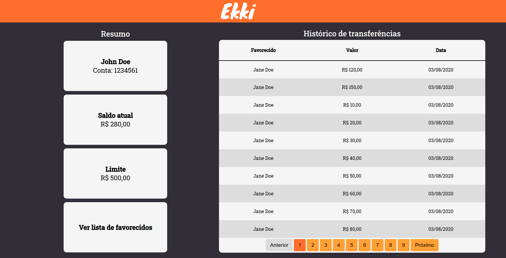

<h1 align="center">
    
</h1>

<h4 align="center">
  💲 Transferência de dinheiro para outras pessoas de forma fácil, objetiva e sem taxas.
</h4>

---

  

---

## 🚀 Tecnologias

Esse projeto foi desenvolvido com as seguintes tecnologias:

### Backend
- [Node.js](https://nodejs.org/en/)
- [ExpressJS](https://expressjs.com/)
- [Docker](https://www.docker.com/)
- [PostgreSQL](https://www.postgresql.org/)
- [TypeORM](https://typeorm.io/)
- [TSyringe (Injeção de dependência)](https://github.com/microsoft/tsyringe)
- [Celebrate (Validation)](https://github.com/arb/celebrate)
- [Jest](https://jestjs.io/)
---
### Frontend
- [React](https://reactjs.org)
- [React Router](https://reactrouter.com/)
- [Styled-Components](https://www.styled-components.com/)
---
### Ambos
- [Typescript](https://www.typescriptlang.org/)
- [Eslint](https://eslint.org/)
- [Prettier](https://prettier.io/)

---

## 💻 Projeto

O Ekki surgiu após a área de produto chegou na conclusão, após diversas pesquisas com usuários, que é necessário criar uma aplicação web para reter seus clientes, onde seja possível transferir dinheiro para outras pessoas de forma fácil, objetiva e sem taxas.

---

## ✋🏻 Pré-requisitos

1. Ter o NodeJS (>=12) instalado;
2. Tenha o Docker instalado;
3. Execute o comando para criação do banco de dados `docker run --name ekki_pg -e POSTGRES_DB=ekki -e POSTGRES_USER=ekki -e POSTGRES_PASSWORD=ekki -p 5432:5432 -d postgres`;
4. Execute as migrations para criação das tabelas `yarn migration:run`;
5. Executa os seeds para popular o banco de dados `yarn seed:run`;

---

## 🔥 Instalação e execução

1. Faça um clone desse repositório;
2. Entre na pasta `cd ekki`;
3. Rode `yarn` dentro das pastas `backend` e `frontend` para instalar as dependências ;
4. Na pasta `backend` execute `yarn dev:server` pra iniciar o servidor de desenvolvimento;
5. Na pasta `frontend` execute `yarn start` pra iniciar o servidor de desenvolvimento;

---

## 📄 Executação dos testes (Backend)

1. Entre na pasta `backend`;
2. Para testes unitários, execute `yarn test:unit`;

---

## 📖 Documentação das rotas

1. Na pasta `backend/docs`, está o arquivo `Insomnia.json`;
2. Importe no Insomnia para ver todas as rotas disponíveis;

---

## 🔨 A fazer

1. Cobrir mais cenários nos testes unitários e de integração;
2. Utilizar a biblioteca faker.js para gerar valores para os testes;
3. Criar testes de integração para o backend;
4. Criar testes E2E para o frontend;

---

Feito com ♥ by João Gabriel :wave:
